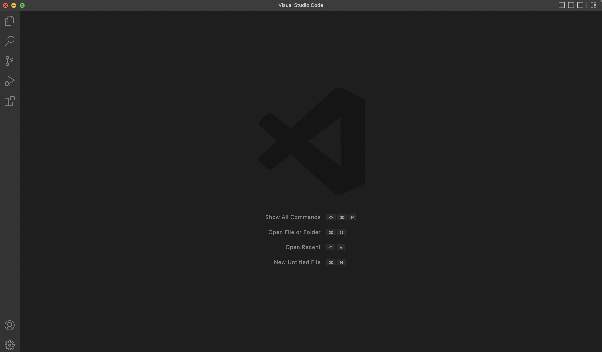
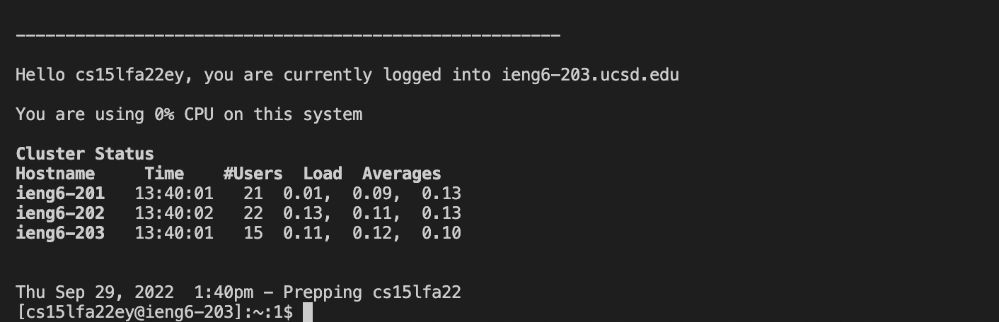
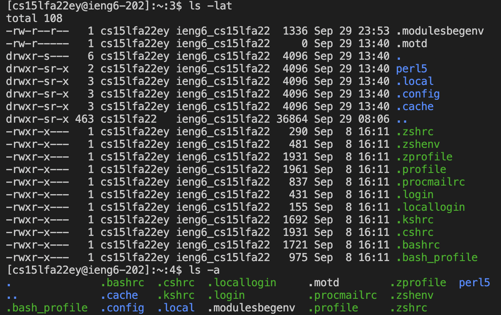
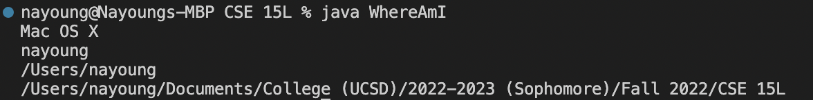
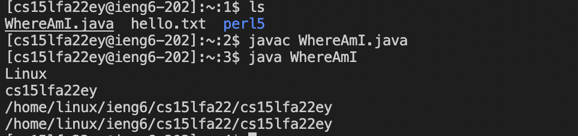
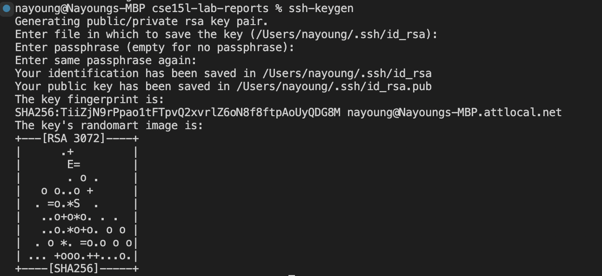
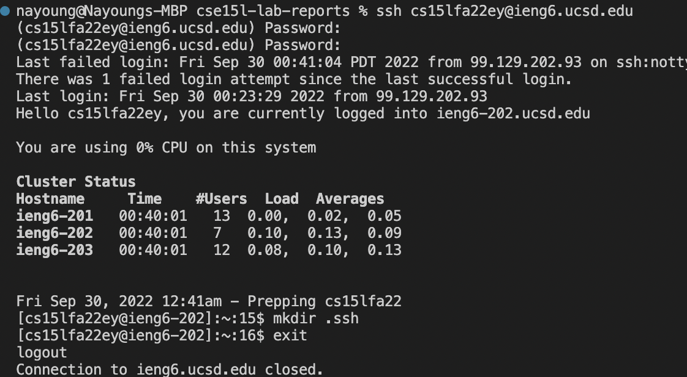
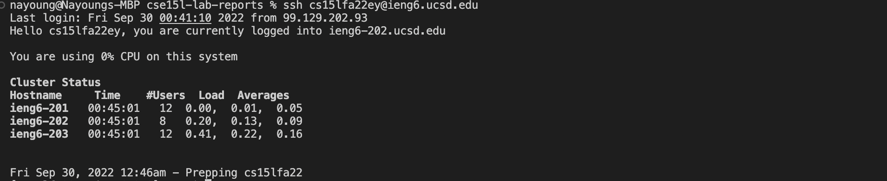

# Lab report 1
## Remote Access and Filesystem

> Installing VS Code 

- Go to  https://code.visualstudio.com/
- Download Visual Studio Code in computer
- There are MacOS and Window versions (Download appropriate version)
- Install VS Code 

This is MacOS version downloaded and opened.


---

> Remotely Connecting 

You can connect the remote server by ssh (The Secure Shell)
- Open terminal in VS Code 
- Type ```ssh cs15lfa22zz@ieng6.ucsd.edu```
(with zz replaced for correct username)
- Enter password 

If it is first time logging in, it could ask **"Are you sure you want to continue connecting (yes/no/[fingerprint])?"** question. 

After successful login, temrminal is now connected to the server.
It will show status like below image. 


--- 
>Trying commands 

There are multiple commands that could be used in the terminal. 

- ls : list all files in current working directory 
- cd : opens current directory 
- cat : reads and prints the file 
- cp : copies the file 

These are few examples of commands. 
When it is run in terminal, it would look like this. 


---

>Moving file with ```scp```

- Create WhereAmI.java (new java file) in the computer with below code
```class WhereAmI {
  public static void main(String[] args) {
    System.out.println(System.getProperty("os.name"));
    System.out.println(System.getProperty("user.name"));
    System.out.println(System.getProperty("user.home"));
    System.out.println(System.getProperty("user.dir"));
  }
}
```
- Complie and run java file in the computer 

It will print like this below 


- In terminal with open java file, input below command to copy file into the server 
```
scp WhereAmI.java cs15lfa22zz@ieng6.ucsd.edu:~/
```
- Log into server 
- Complie and run java file in the server


Notice that WhereAmI.java file is added in the directory.

Also different username and os name is printed depending if the java file was run in computer or server. 

---
>Setting an SSH key

When logging into the server, it is difficult to enter password everytime. To make this easiler, there is SSH key. 

- Enter ```ssh-keygen``` in the computer terminal 

It will look like below.


- Enter ```ssh cs15lfa22zz@ieng6.ucsd.edu``` and log in
- Enter ```mkdir .ssh``` in the server 
- Back to computer, copy id_rsa.pub into server by enter
```scp /Users/(username)/.ssh/id_rsa.pub cs15lfa22zz@ieng6.ucsd.edu:~/.ssh/authorized_keys```


After this, password is not required when logging into the server. 

