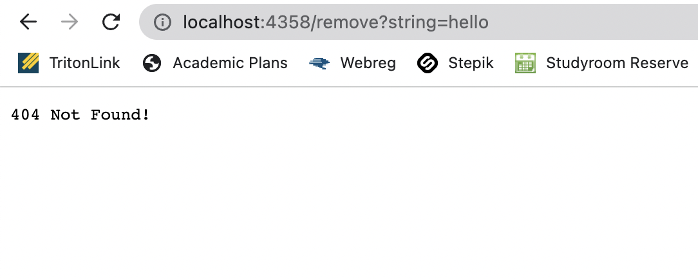

# Lab report 2
## Part 1 - SearchEngine.java
Below is the code that I wrote for SearchEngine.java 
```
class SearchHandler implements URLHandler {
    // The one bit of state on the server: string can be added and searched by
    // various requests.
    ArrayList <String> list = new ArrayList<String>();

    public String handleRequest(URI url) {
        String[] parameters = url.getQuery().split("=");
        if (parameters[0].equals("s")) {
            if (url.getPath().contains("/add")) {
                list.add(parameters[1]);
                return parameters[1] + " is now added to search engine";
            }
            if (url.getPath().contains("search")){
                ArrayList <String> resultList = new ArrayList<String>();
                for (int i = 0; i < list.size(); i++){
                    if (list.get(i).contains(parameters[1])){
                        resultList.add(list.get(i));
                    }
                }

                if (resultList.size()!=0){
                    String result;
                    result = returnArrayList(resultList);
                    return result; 
                }
                
                else {
                    return "No words in search engine with " + parameters[1];
                }
            }
        }
        return "404 Not Found!";
    }

    public String returnArrayList(ArrayList<String> list){
        String result = "";
        for (int i=0; i<list.size();i++){
            result = result + list.get(i) + " ";
        }
        return result; 
    }
```
After starting the server, I added anewstringtoadd to the search engine by /add?s=anewstringtoadd. 

- handleRequest method is called 
- parameters[0] is equal to 's' that is between ? and =
    - If this value was changed, it would return "404 Not Found!" 
- parameters[1] is equal to 'anewstringtoadd' which is added to ArrayList list that represents the search engine. 
    - If this value was changed, it changes the string that will be added into the search engine. 

For next screenshot, I searched string with app after adding anewstringtoadd, apple, and pineapple. 

- handleRequest method and returnArrayList method that I added to use as a helper method was called.
- parameters[0] equal to 's' 
    - If this value was changed, it would return "404 Not Found!"
- parameter[1] is equal to 'app' and the code finds the string with 'app' and returns those strings. Those words that contiains the 'app' are now added to the result arraylist and store that into string value using returnArrayList method. 
    - If this value was changed, it would find the strings with newly changed value. 

For last screenshot, I wrote wrong url and it showed "404 Not Found!" 

- handleRequest mehtod is called. 
- the path contains "/remove" and it will result "404 Not Found!" because the search engine only takes "/add" or "/search" 
    - If this is changed to "/add" or "/search" it would either add or search but if it is different, it will still show "404 Not Found!"
- parameter[0] is equal to "string" so it also causes error because it either add or search the string when the parameter[0] is equal to "s". 
    - If this is changed to 's' it would work but if it is different, it will still show "404 Not Found!"

## Part 2 - Bugs in Arraylist 