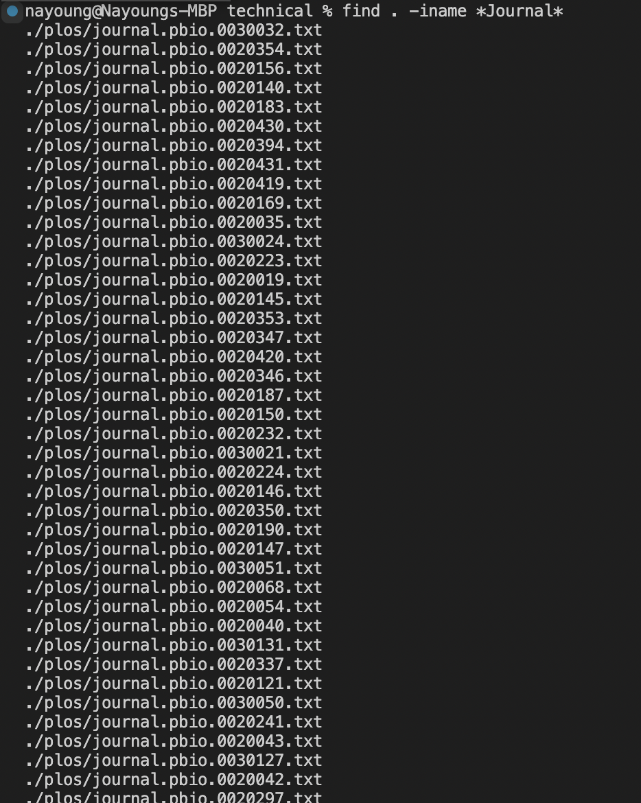
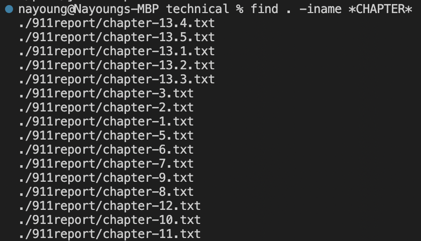
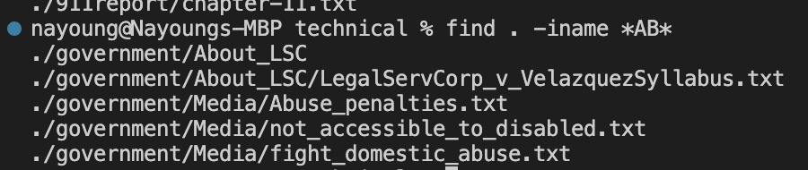
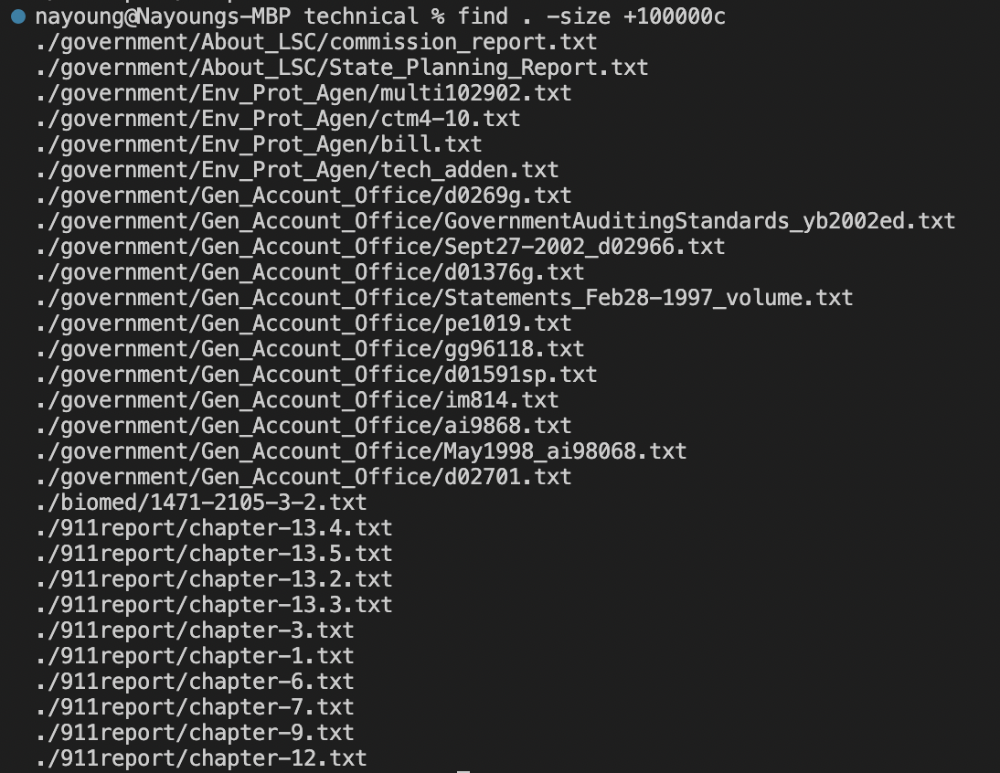
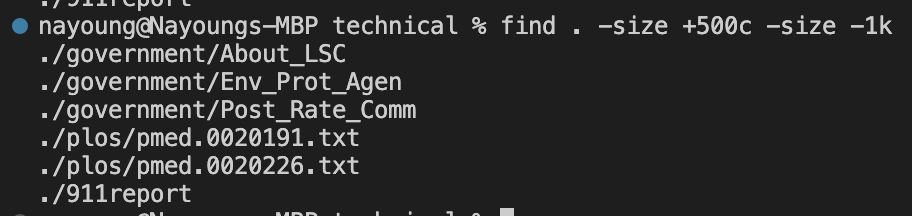
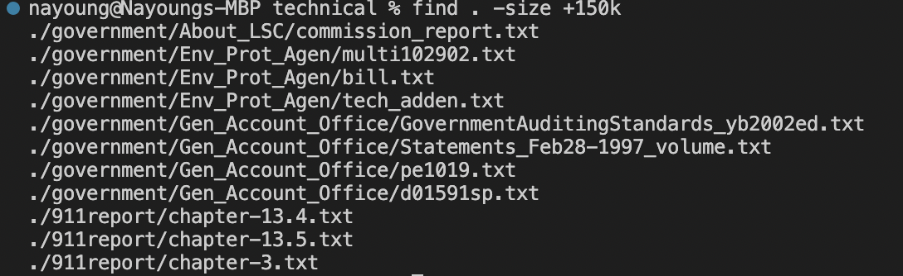
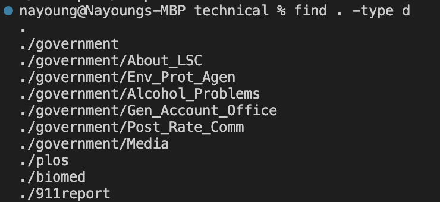
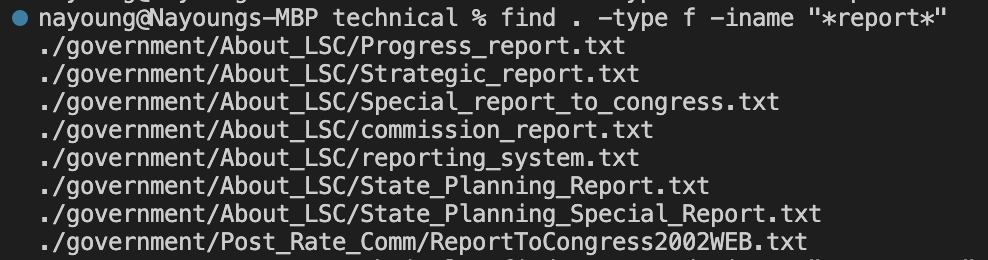

# Lab report 3
## Research commands 

Of the three commands : less, find, grep, I choosed find command to research. 

> find -iname 

-iname option is similar to -name, but interesting because it does not care about caplitalization. 

This is useful to find file or directories with certain name without any concern about capitalization. 

```
find . -iname *Journal*
```

This finds any file or directory with name Journal but it is not sensitive to capitalization so it showed files with journal as well. 

```
find . -iname *CHAPTER*
```

This finds any file or directory with name CHAPTER but it is not sensitive to capitalization so it showed files with lowercase chapter. 
```
find . -iname *AB*
```

This finds any file or directory with name AB but it is not sensitive to capitalization so it showed files and directories with ab. 

---


> find -size

-size option allows the user to search the file based on the size of the file. 

It is useful when finding large files or small files to sort the files. 
```
find . -size + 100000c 
```

This finds any file and directory that are larger than 100,000 bytes. 

```
find . -size +500c -size -1k
```

This finds any file and directory that are larger than 500 bytes and smaller than 1 kibibytes. 

```
find . -size +150k
```

This finds any file and directory that are larger than 150 kibibytes.

---


> find -type

-type allows user to search type of file that user want 

This is useful when finding certain file or directory combined with -iname because it will only show file or directory by user's choice. 

```
find . -type d
```

This finds only directories inside of this directory. 


```
find . -type d -iname government
```

This finds only directories with name goverment. 

```
find . -type d -iname "*report*"
```

This finds only files with name containing report. 