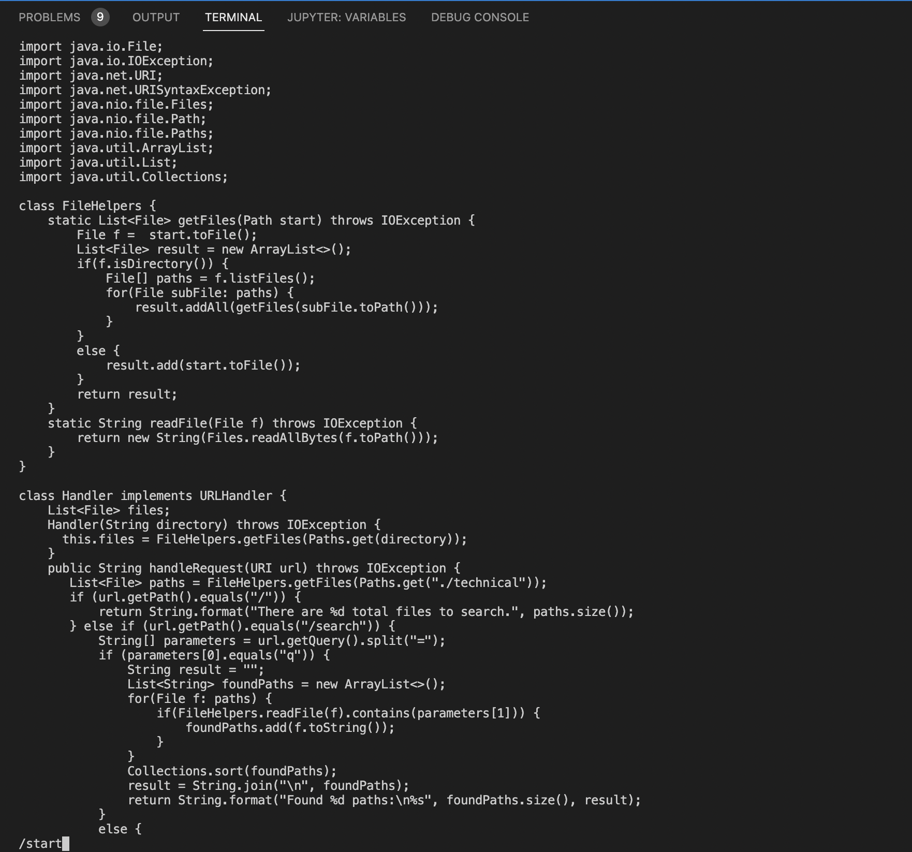
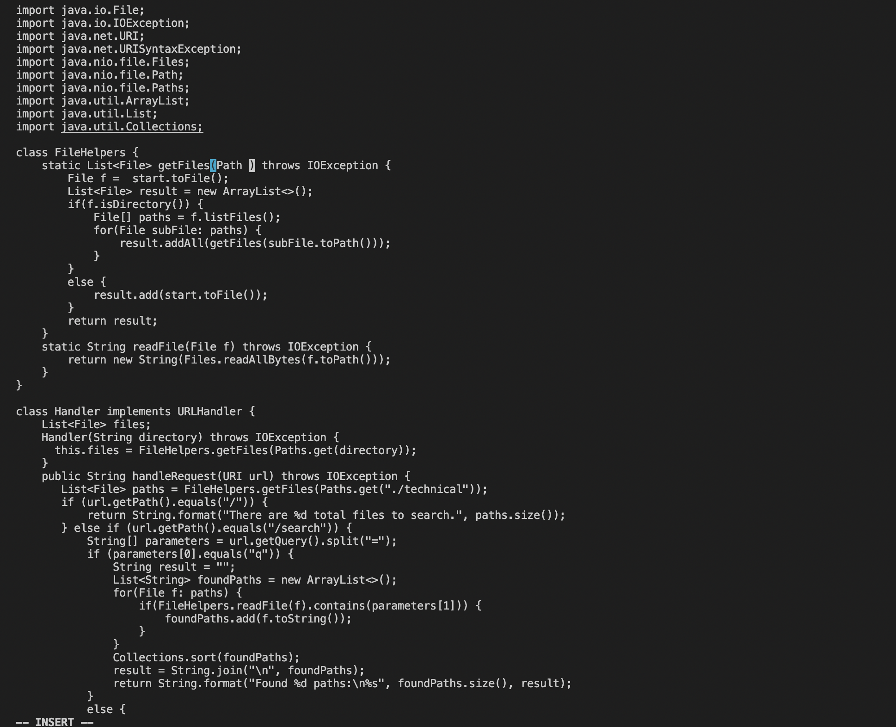
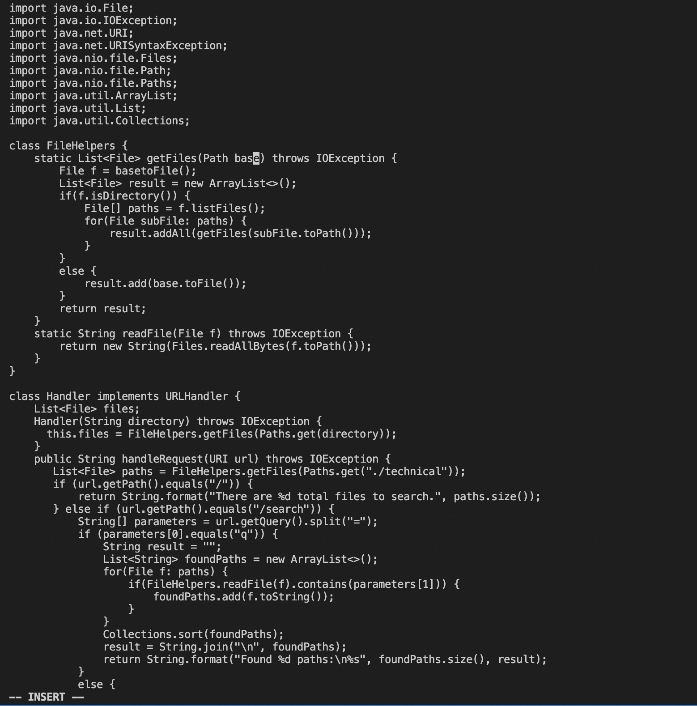
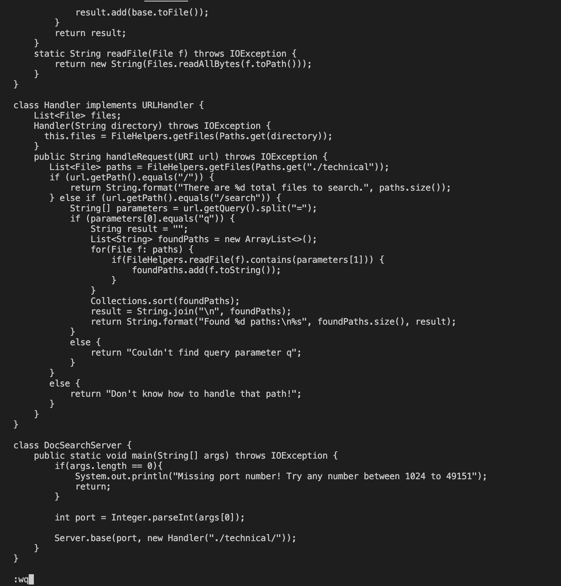

# Lab report 4
## Using Vim to edit file 
> part 1 

Task: Changing the name of the start parameter and its uses to base

vim commands : ```/start<Enter>cebase<Esc>N.N.N.:wq<Enter>```

```/start <Enter> ``` to find 'start' 


``` ce ``` to remove the 'start' 


``` base ``` to write 'base'


``` N.N.N. and :wq``` to find and repeat the previous step, writing base and save & quit the vim 


> part 2 

If I had to work on a program that I was running remotely, I perfer the first strategy because it is easier to edit the file using vs code rather than vim. 

When making the decision, the facter that matter is how easy to edit the file. Even though I learned how to edit the file using vim, still it is easier for me to edit the file using vs code. So I choosed the first option. If editing the file using vim gets used to it, it could be possible to choose the second option. 
