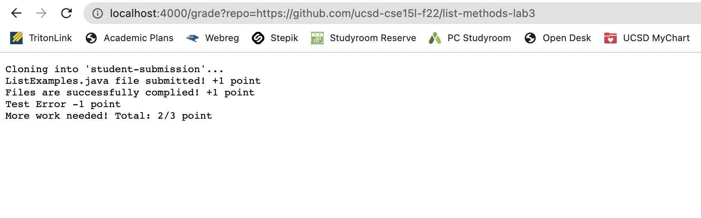
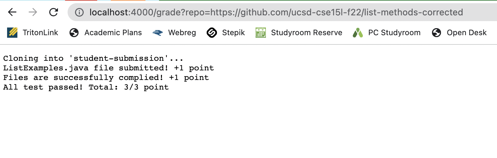
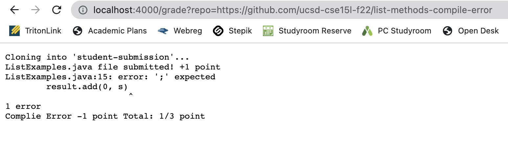

# Lab report 5
## Grading Script
> grade.sh code 

```
rm -rf student-submission
mkdir student-submission
git clone $1 student-submission
cp TestListExamples.java student-submission
cd student-submission
GRADE=0 

if [[ -e ListExamples.java ]]
then 
    echo "ListExamples.java file submitted! +1 point"
    ((GRADE++))
else 
    echo "ListExamples.java file is missing -1 point Total:" $GRADE"/3 point"
    exit 1
fi
CPATH=".:../lib/hamcrest-core-1.3.jar:../lib/junit-4.13.2.jar"
javac -cp $CPATH *.java
if [[ $? -eq 0 ]]
then
    echo "Files are successfully complied! +1 point"
    ((GRADE++))
else 
    echo "Complie Error -1 point Total:" $GRADE"/3 point"
    exit 1
fi 

java -cp $CPATH org.junit.runner.JUnitCore TestListExamples 
if [[ $? -eq 0 ]]
then
    ((GRADE++)) 
    echo "All test passed! Total:" $GRADE"/3 point"
    exit 0

else 
    echo "Test Error -1 point"
    echo "More work needed! Total:" $GRADE"/3 point"
    exit 1
fi 
```

> grade.sh in GradeServer 





> Trace of the code with last screenshot

```rm -rf student-submission ```
: removed the folder student-submission 

```mkdir student-submission``` 
: crate a new folder named student-submission 

```git clone $1 student-submission```
: clones the linked github repository into the folder named student-submission in this line standard error "Cloning into 'student-submission'..." is printed

```cp TestListExamples.java student-submission```
: copies the TestListExamples.java file into the student-submission folder 

```cd stduent-submission```
: changes current directory to student-submission folder

```GRADE=0```
: creates variable named GRADE and equal to 0 to trace the grade 

```if [[ -e ListExamples.java ]]```
: checks if the ListExmaples.java file exists. In this case, the file exists. Condition is true. So it goes to the ```then``` statement and ```echo "ListExamples.java file submitted! +1 point"``` by standard output and increments GRADE by ```((GRADE++))```.

```else echo "ListExamples.java file is missing -1 point Total: " $GRADE"/3 point" exit 1 fi``` 
: these lines are not runned because the if condition was true. 

```CPATH:".:../lib/hamcrest-core-1.3.jar:../lib/junit-4.13.2.jar" ```
: variable CPATH created to make javac and java command easiler 

```javac -cp $CPATH *.java```
: complie the java files and because this file returns the complie error, it printed the standard error. 

```if [[ $? -eq 0 ]]```
:  checks if complie was successful but the condition is false because there was complie error. 

```then echo "Files are successfully complied! +1 point" (GRADE++)```
: these lines are not runned because the if statement was false. 

```else echo "Complie Error -1 point Total:" $GRADE"/3 point"``` 
: this line is runned because the condition of if statement was false. It echo "Complie Error -1 point Total:" $GRADE"/3 point" with standard output. 

```exit 1``` 
: return code was non-zero and all of the line after this line is not runned because this is an early exit. 
